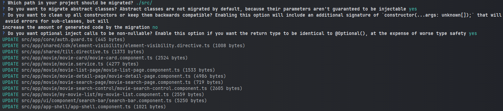

# Modern Angular - inject automatic migration

In this exercise we will make use of Angular schematic to migrate our application to the new `inject` function in order to get rid of the constructor based dependency injection.

## Migrate to inject
In order to migrate to the new `inject` function, we need to use the `ng generate` command.

```bash
npx ng g @angular/core:inject 
```

You should see the following output:

```
? Which path in your project should be migrated? ./src/
? Do you want to migrate abstract classes? Abstract classes are not migrated by default, because their parameters aren't guaranteed to be injectable yes
? Do you want to clean up all constructors or keep them backwards compatible? Enabling this option will include an additional signature of `constructor(...args: unknown[]);` that will avoid errors for sub-classes, but will increase the amount of generated code by the migration no
? Do you want optional inject calls to be non-nullable? Enable this option if you want the return type to be identical to @Optional(), at the expense of worse type safety yes
```

> [!NOTE]
> Pass the application root ./src/ as path to migrate the whole app.
> Reject prompt to keep constructors backwards compatible
> Agree to migrate abstract classes as well when asked.
> Agree to clean up all constructors when asked.

<details>
  <summary>Migration output</summary>



</details>

After the migration is complete, inspect the changes in your git diff.
You should see that all your constructors are now replaced with the `inject` function 🎉.
